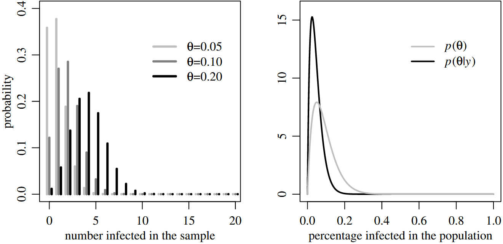
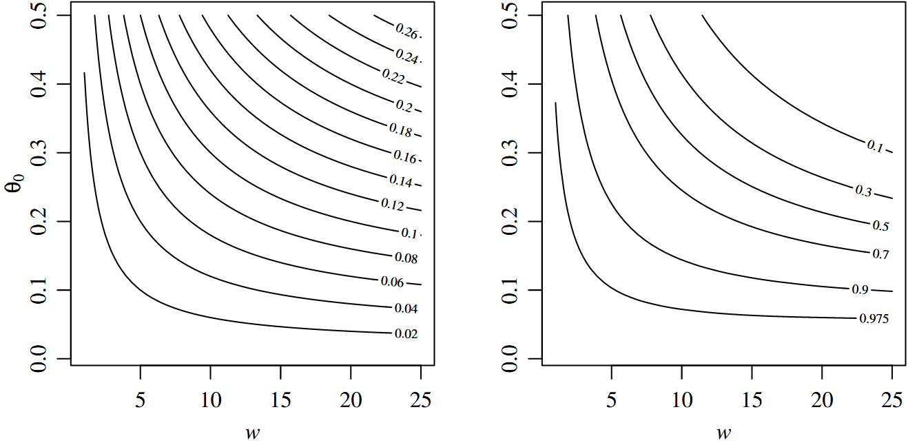
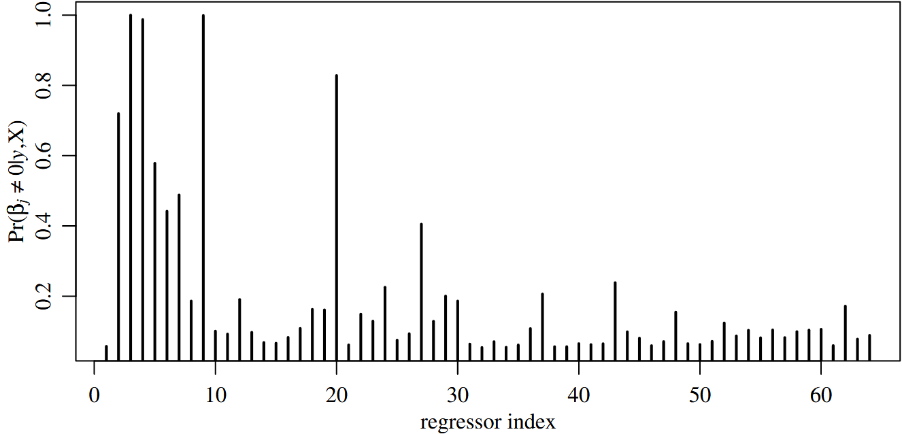
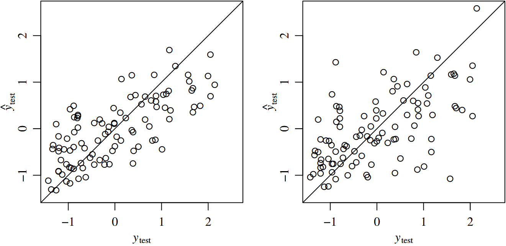

# 1.1 介绍
我们经常非正式地使用**概率**（*Probability*）来表达我们对未知量的信息与信念。然而，概率用于表达信息的这种方式可以被形式化：从精确的数学角度来看，可以证明，概率能够以数值形式表示一组合理的信念，概率与信息之间存在关系，而贝叶斯定理提供了一种在面对新信息时合理更新信念的方法。基于贝叶斯定理的归纳学习过程被称为贝叶斯推断（*Bayesian Inference*）。

更广泛地说，贝叶斯方法（*Bayesian Methods*）是基于贝叶斯推断原理的数据分析工具。除了作为归纳手段的正式解释外，贝叶斯方法还提供了：
- 具有良好统计特性的参数估计
- 对观测数据的简洁描述
- 对缺失数据的预测，以及对未来数据的预测
- 用于模型估计、选择和验证的计算框架

因此，贝叶斯方法的应用范围超出了其针对的“归纳”这一任务。在本书中，我们将探讨贝叶斯方法在各种推断和统计任务中的广泛应用。本章首先介绍贝叶斯学习的基本要素，随后通过一些实际应用示例展示贝叶斯方法的不同使用方式。
### 贝叶斯学习
统计归纳是从总体的一个子集中学习总体的普遍特征的过程。总体特征的数值描述通常用参数（*Patameter*） $`\theta`$ 表示，而子集的数值描述则构成了数据集（*Dataset*） $`y`$。在获得数据集之前，总体特征和数据集的数值都是不确定的。一旦获得数据集 $`y`$，其中包含的信息就可以用来减少我们对总体特征的不确定性。量化这种不确定性的变化，正是贝叶斯推断的目的。

样本空间（*Sample Space*） $`\mathcal{Y}`$ 是所有可能数据集的集合，从中将得到一个具体的数据集 $`y`$。参数空间（*Parameter Space*） $`\mathit{\Theta}`$ 是所有可能参数值的集合，我们希望从中识别出最能代表真实总体特征的值。贝叶斯学习的理想化形式始于对 $`y`$ 和 $`\theta`$ 的联合信念的数值表述，这些信念通过样本空间 $`\mathcal{Y}`$ 和 $`\mathit{\Theta}`$ 上的概率分布来表达。

1. 对于每个参数 $`\theta \in \mathit{\Theta}`$，先验分布（*Prior Distribution*） $`p(\theta)`$ 描述了：我们相信参数 $`\theta`$ 代表真实总体特征的程度。
2. 对于每个参数 $`\theta \in \mathit{\Theta}`$ 和数据集 $`y \in \mathcal{Y}`$，抽样模型（*Sampling Model*） $`p(y|\theta)`$ 描述了：如果我们知道 $`\theta`$ 为真，能够推出数据 $`y`$ 的信念。

一旦我们获得了数据 $`y`$，最终我们便可更新我们对 $`\mathit{\Theta}`$ 的信念：
3. 对于每个参数 $`\theta \in \mathit{\Theta}`$，后验分布（*Posterior Distribution*） $`p(\theta|y)`$ 描述了：在观察到数据集 $`y`$ 后，我们相信参数 $`\theta`$ 为真实值的程度。

后验分布通过贝叶斯定理从先验分布和抽样模型中获得：

```math
p(\theta|y)=\frac{p(y|\theta) p(\theta)}{\int _{\Theta}p(y|\tilde{\theta})p(\tilde{\theta}) \, d\tilde{\theta} }
```

值得注意的是，贝叶斯定理并没有告诉我们“我们的信念应该是什么样子的”，而是告诉了我们“在获得新信息后，信念是如何改变的”。
# 1.2 为何选择贝叶斯？
Cox(1946, 1961)和Savage(1954, 1972)证明，如果 $`p(\theta)`$ 和 $`p(y|\theta)`$ 代表了一个理性人的信念，那么贝叶斯定理就是在获得新信息 $`y`$ 时，更新其对 $`\theta`$ 信念的最优方法。这一结果为将贝叶斯法则作为定量学习方法提供了强有力的理论依据。然而，在实际数据分析中，我们的先验信念往往难以用数学方法精确表达，因此 $`p(\theta)`$ 通常以某种临时的原则、或出于计算便利的原则而被选择。那么，贝叶斯数据分析的依据是什么？

关于抽样模型，有一个著名的说法：“所有模型都是错误的，但有一些是有用的”(Box and Draper, 1987, pg. 424)。同样，如果 $`p(\theta)`$ 不能准确反映我们的先验信念，它可能被视为“错误”的；然而，这并不意味着 $`p(\theta|y)`$ 是无用的。如果 $`p (\theta)`$ 近似于我们的信念，那么在 $`p (\theta)`$ 下， $`p (\theta|y)`$ 是最优的，这意味着它通常也会很好地近似于我们的后验信念。

在其他情况下，我们关注的可能并不是我们自身的信念，而是想用贝叶斯定理来探索数据如何更新持有不同先验观点的人的信念，特别是那些持有弱先验信息的人，他们的后验信念可能更有趣。这激发了使用“扩散性”(*diffuse*)先验分布的使用，这种分布在参数空间上广泛而均匀地分配概率。

最后，在许多复杂的统计问题中，并没有明显的非贝叶斯估计或推断方法。在这些情况下，贝叶斯方法可用于生成估计过程，并且这些过程的性能可以利用非贝叶斯标准来评估。在许多情况下，已经证明基于贝叶斯或近似贝叶斯的方法非常有效，即使对于非贝叶斯场景也奏效。

接下来的两个例子将展示贝叶斯推断如何使用先验分布，这些先验分布可能只是粗略地代表我们或其他人的先验信念，可以广泛地用于统计推断。计算的大部分数学细节将留待后续章节讨论。

## 1.2.1 估计罕见事件的概率
假设我们的研究目标是某种传染病在一个小城市的流行情况。居民感染率越高，建议采取的公共卫生预防措施就越强力。我们从该市随机抽取 20 人进行感染检查。

### 参数空间与样本空间
我们感兴趣的参数是感染居民数量占城市中全部居民数量之比，用 $`\theta`$ 表示，简言之，其对应的参数空间包含 0 至 1 的所有数字。而数据 $`y`$ 表示样本中感染居民的数量。则参数空间和样本空间可表示为

```math
\Theta=[0,1]\quad\mathcal{Y}=\{0,1,\dots,20\}.
```

### 采样模型
采样之前，样本中感染居民的数量是未知的，我们用 $`Y`$ 来表示这组待定数值。如果参数 $`\theta`$ 是已知量，一个针对 $`Y`$ 的、合理的采样模型可以被二项分布 $`\mathrm{bionomial}(20,\theta)`$ 进行描述：

```math
Y|\theta \sim \mathrm{binomial}(20,\theta).
```



图1.1 感染率示例的抽样模型 、先验分布和后验分布。左图为三种参数 $`\theta`$ 取值下的$`\mathrm{bionomial}(20,\theta)`$，右图为参数 $`\theta`$ 的先验（灰色线）和后验（黑色线）。

图 1.1 左侧描绘了当参数 $`\theta`$ 为 0.05,0.10 和 0.20 时的二项分布 $`\mathrm{binomial}(20,\theta)`$。举个例子：当真实感染率为 0.05 时，样本中零感染 $`(Y=0)`$ 的概率为 36%；如果真实感染率分别为 0.10 和 0.20，则 $`Y=0`$ 的概率分别为 12% 和 1%。
### 先验分布
调查数据指出，国内近似规模城市中该疾病的感染率在 0.05 至 0.20 之间，平均感染率 0.10。我们使用先验分布 $`p(\theta)`$ 表征上述先验信息，将大部分的概率分配在区间 $`(0.05,0.20)`$ 之间，且令感染率的期望位于 0.10 附近。然而，有无穷多个分布能够满足上述条件，我们的先验信息有限，无法在这些分布中做出区分。因此，我们将选择满足以上特征且计算方便的先验分布 $`p(\theta)`$，具体而言，它来自 Beta 分布族。Beta 分布具有两个参数 $`(a,b)`$，如果 $`\theta`$ 服从 Beta 分布，则 $`\theta`$ 的期望为 $`\frac{a}{a+b}`$，$`\theta`$ 最可能的值（众数）为 $`\frac{{a-1}}{a-1+b-1}`$。在该问题中，$`\theta`$ 代表感染率，我们把 $`\theta`$ 的先验信息使用 Beta 分布 $`\mathrm{beta}(2,20)`$ 进行表征，即

```math
\theta \sim \mathrm{beta}(2,20).
```

该先验分布如图 1.1 右侧灰色线所示，其期望为 0.09，曲线在 $`\theta=0.05`$ 处达到峰值，曲线下的面积大约有 2/3 位于 0.05 至 0.20 之间，感染率低于 0.10 的先验概率为 64%。

```math
\begin{align}
E[\theta]&=0.09 \\
\mathrm{mode}&=0.05 \\
\mathrm{Pr}(\theta<0.10)&=0.64 \\
\mathrm{Pr}(0.05<\theta<0.20)&=0.66.
\end{align}
```

### 后验分布
我们将在第 3 章学到，如果满足 $`Y|\theta \sim \mathrm{binomial}(n, \theta)`$ 且 $`\theta \sim \mathrm{beta}(a, b)`$，那么对于观测到 $`Y`$ 对应的数值 $`y`$，后验分布将满足 $`\mathrm{beta}(a+y, b+n-y)`$ 分布。
举个例子，假如在我们的研究中最终观测到 $`Y = 0`$，即 20 个样本中的个体均未受感染，那么 $`\theta`$ 的后验分布将是 $`\mathrm{beta}(2+0,20+20-0)`$ 分布，即 $`\mathrm{beta}(2, 40)`$ 。
该后验分布如图 1.1 右侧黑色线所示——它比先验分布更靠左，这是因为 $`Y=0`$ 的观测结果提供了 $`\theta`$ 值较低的证据；曲线更加尖锐，这是因为它结合了数据与先验分布的双重信息。曲线峰值位于 $`\theta=0.025`$ 处，$`\theta`$ 的后验期望为 0.048，$`\theta<0.10`$ 的后验概率达到 93%。

```math
\begin{align}
E[\theta|Y=0]&=0.048 \\
\mathrm{mode}[\theta|Y=0]&=0.025 \\
\mathrm{Pr}(\theta<0.10|Y=0)&=0.93.
\end{align}
```

后验分布 $`p(\theta|y)`$ 为我们了解全市感染率 $`\theta`$ 提供了一个模型。从理论角度来看，一个具备 $`\mathrm{beta}(2, 20)`$ 先验分布的理性人，获知新信息后，现在他的信念由 $`\text{beta}(2, 40)`$ 分布表示。从实际角度来看，如果我们接受 $`\text{beta}(2, 20)`$ 分布作为先验信息的合理度量，那么随后我们也接受 $`\text{beta}(2, 40)`$ 分布作为后验信息的合理度量。
### 敏感性分析
假设我们要与卫生部门官员讨论调查结果，在与来自不同背景的人群讨论研究的影响时，描述各种先验分布相对应的后验信念可能会有所帮助。假设我们的先验分布是 $`\mathrm{beta}(a,b)`$ 而非 $`\mathrm{beta}(2,20)`$，即参数 $`\theta \sim \mathrm{beta}(a,b)`$，那么给定 $`Y=y`$ 时参数 $`\theta`$ 的后验分布是 $`\mathrm{beta}(a+y,b+n-y)`$，则后验期望表示为

```math
\begin{align}
E[\theta|Y=y]&= \frac{a+y}{a+b+n} \\
&=\frac{n}{a+b+n} \frac{y}{n}+ \frac{a+b}{a+b+n} \frac{a}{b} \\
&=\frac{n}{w+n} \bar{y}+\frac{w}{w+n}\theta_{0}
\end{align}
```

其中，$`\theta_{0}=\frac{a}{a+b}`$ 是 $`\theta`$ 的先验期望，$`w=a+b`$ 。通过上式我们可以看出，后验期望是样本均值 $`\bar{y}`$ 和先验期望 $`\theta_{0}`$ 的加权平均。估计 $`\theta`$ 时，$`\theta_{0}`$ 代表我们对 $`\theta`$ 真实值的先验猜测，而 $`w`$ 代表我们对这一猜测的置信度，其尺寸与样本大小相同。

如果有人向我们提供了一个先验猜测 $`\theta_{0}`$ 和置信度 $`w`$，我们可以用参数为 $`a=w\theta_{0}`$ 和 $`b=w(1-\theta_{0})`$ 的 Beta 分布 $`\mathrm{beta}(w\theta_{0}+y,w(1-\theta_{0})+n-y)`$ 来近似先验信念。我们以一组不同 $`\theta_{0}`$ 和 $`w`$ 的值计算后验分布，以进行敏感性分析（*Sensitivity Analysis*），探索后验信息如何受到先验观点差异的影响。



图 1.2 不同Beta先验分布下的后验。随着先验期望和置信度的改变，左图描绘了后验期望 $`E[\theta|Y=0]`$ 的等高线图，右图描绘了后验概率 $`\mathrm{Pr}(\theta<0.10|Y=0)`$ 的等高线图。

图 1.2 绘制了两个后验量随先验分布参数 $`\theta_{0}`$ 和 $`w`$ 的变化而发生变化的等高线图，左图是后验期望 $`E[\theta|Y=0]`$ 的等高线，右图是后验概率 $`\mathrm{Pr}(\theta<0.10|Y=0)`$ 的等高线。如果卫生部门希望在感染率低于 0.10 时才向居民推行疫苗，右面的这张后验概率图可能会有所帮助，该图表明：拥有弱先验信念（低 $`w`$ 值）或低先验期望的人通常有 90% （或更高）的置信度认为感染率低于 0.10；然而，只有那些原本就已经坚定认为（高 $`w`$ 值）感染率低于其他城市平均水平的人，才能达到 97.5%的置信度。 
### 与非贝叶斯方法进行对比
对于总体比例 $`\theta`$ 的标准估计，通常使用样本均值 $`\bar{y} = \frac{y}{n}`$，即样本中感染者的比例。在我们的样本中，如果测得 $`y = 0`$，那么这个估计自然会给出零值，这意味着我们得到的估计是——城市中没有感染者。如果我们向医生或卫生部门官员报告这个估计，我们可能需要附加一个警告，即这个估计受到抽样不确定性的影响。描述估计的抽样不确定性的一种方法是使用置信区间（*Confidence Interval*）。一个常用的 95%置信区间是 Wald 区间（*Wald Interval*），其公式为：

```math
\bar{y}\pm 1.96\sqrt{ \frac{\bar{y}(1-\bar{y})}{n} }
```

该置信区间具有正确的渐近频率覆盖（*Correct Asymptotic Frequentist Coverage*），意味着如果 $`n`$ 很大，那么大约有95%的概率，$`Y`$ 会取到一个值 $`y`$，使得上述区间包含 $`\theta`$。不幸的是，它并不适用于小样本：对于 $`n`$ 约为20的情况，区间包含 $`\theta`$ 的概率仅为约80% (Agresti and Coull, 1998)。无论如何，对于我们的样本（$`y = 0`$），Wald置信区间退化为一个点：0。事实上，99.99%的Wald区间结果为零。我们绝不希望从调查中得出“我们有99.99%的把握确定城市中没有人感染”这一结论。

为了规避这一问题，人们提出了多种Wald区间的替代方案。其中一种在非贝叶斯标准下表现良好的置信区间是Agresti和Coull（1998）提出的修正 Wald 区间，其公式为

```math
\begin{align}
\bar{\theta}&\pm 1.96\sqrt{ \frac{{\hat{\theta} (1-\hat{\theta} )}}{n} },\text{where} \\
\hat{\theta}&=\frac{n}{n+4}\bar{y} + \frac{4}{n+4} \frac{1}{2}
\end{align}
```

这个区间显然与贝叶斯推断有关：此处的 $`\theta`$ 值等同于在 $`\mathrm{beta}(2,2)`$ 的先验分布下的后验均值，包含了以 $`\theta=\frac{1}{2}`$ 为中心的弱先验信息。

### 总体均值的广义估计
给定来自一个总体的、由 $`n`$ 个观测值组成的随机样本，总体均值 $`\theta`$ 的一个标准估计是样本均值 $`\bar{y}`$。正如前述例子，样本数量 $`n`$ 充足时， $`\bar{y}`$ 通常是一个可靠的估计，对于小 $`n`$，它在统计上可能并不可靠，此时它更多地作为样本数据的总结，而不是 $`\theta`$ 的精确估计。
如果我们的兴趣更多在于获得 $`\theta`$ 的估计，而不是总结样本数据，我们可能希望考虑以下形式的估计量

```math
\hat{\theta}=\frac{n}{n+w} \bar{y} + \frac{n}{n+w} \theta_{0}
```

其中 $`\theta_{0}`$ 代表对 $`\theta`$ 真实值的“最佳猜测”，$`w`$ 代表对这一猜测的置信度。当样本量 $`n`$ 较大时， $`\bar{y}`$ 是 $`\theta`$ 的可靠估计。估计量 $`\hat{\theta}`$ 通过让 $`\bar{y}`$ 和 $`\theta_{0}`$ 的权重来利用这一点，随着 $`n`$ 的增加，两者分别趋近于 1 和 0 。因此，对于大 $`n`$， $`\bar{y}`$ 和 $`\hat{\theta}`$ 的统计特性基本相同。然而，对于小 $`n`$， $`\bar{y}`$ 的变异性可能超过我们对 $`\theta_{0}`$ 的不确定性。在这种情况下，使用 $`\hat{\theta}`$ 可以结合数据与先验信息，从而稳定我们对 $`\theta`$ 的估计。

估计量 $`\hat{\theta}`$ 在大样本量和小样本量的这些特性表明，它对于广泛的 $`n`$ 值都是一个有用的 $`\theta`$ 估计。在第5.4节中，将通过证明在某些条件下，$`\hat{\theta}`$ 在所有 $`n`$ 值下都优于 $`\bar{y}`$。$`\hat{\theta}`$ 可视为使用特定类别先验分布的贝叶斯估计量，这一点在上文感染率示例中得到了印证，后续章节中也将常出现。即使某个特定的先验分布 $`p(\theta)`$ 不能完全反映我们的先验信息，相应的后验分布 $`p(\theta|y)`$ 仍然能在样本量 $`n`$ 较低的情况下提供稳定的推断和估计。
## 1.2.2 建立一个预测模型

在第 9 章中，我们将讨论一个例子，在这个例子中，我们的任务是建立一个预测糖尿病进展的模型，该模型基于 64 个基线解释变量，如年龄、性别和体重指数等。这里我们简要概述一下：首先，我们使用包含342名患者数据的“训练”数据集，估计回归模型中的参数；然后，我们将使用另一组包含100名患者数据的“测试”数据集，评估上一步估计得出的回归模型的预测性能。

### 采样模型与参数空间
将 $`Y_{i}`$ 记作第 $`i`$ 个受试者的糖尿病进展情况， $`\boldsymbol{x_{i}}=(x_{i,1},\dots,x_{i,64})`$ 为解释变量，我们考虑以下形式的线性回归模型

```math
Y_{i}=\beta_{1}x_{i,1}+\beta_{2}x_{i,2}+\dots+\beta_{64}x_{i,64}+\sigma \epsilon_{i}.
```

该模型中的 65 个未知参数包括回归系数向量 $`\beta=(\beta_{1},\dots,\beta_{64})`$ 以及误差项的标准差 $`\sigma`$。对于 $`\boldsymbol{\beta}`$ 来说，参数空间是 64 维的欧几里得空间，而对于 $`\beta`$ 来说则是代表正实数的直线。

### 先验分布
在大多数情况下，为 65 个参数定义一个能够准确反映先验信念的联合先验概率分布几乎是不可能的任务。作为替代方案，我们将使用一个仅反映部分先验信念的先验分布。我们希望表达的主要信念是：64 个解释变量中，大多数对糖尿病进展的影响微乎其微，即它们的大多数回归系数为零。在第 9 章中，我们将讨论一个关于 $`\boldsymbol{\beta}`$ 的先验分布，它大致反映了上述信念：即所有 64 个回归系数有 50% 的先验概率等于零。

### 后验分布
给定数据 $`\boldsymbol{y}=(y_{1},\dots,y_{342})`$ 和 $`\mathbf{X}=(\boldsymbol{x}_{1},\dots,\boldsymbol{x}_{342})`$ ，可以计算并得到后验分布 $`p(\boldsymbol{\beta}|\boldsymbol{y},\mathbf{X})`$ ，并据此获得各回归系数 $`j`$ 不等于 0 的后验概率 $`\mathrm{Pr}(\beta_{j} \neq 0|\boldsymbol{y},\mathbf{X})`$，这一概率如图 1.3。尽管在先验分布中，64 个系数中的每一个都被设为有 50% 的概率为非零，但最后只有 6 个 $`\beta_{j}`$ 的后验概率 $`\mathrm{Pr}(\beta_{j} \neq 0|\boldsymbol{y},\mathbf{X})\geq 0.5`$，其余系数为零的后验概率非常高。先验分布首先允许了零系数的广泛存在，但随着数据不断引入新的信息，导致出现零系数的概率显著增加。


图1.3 各系数非零的后验概率。

### 预测性能、对比非贝叶斯方法
此处，通过使用该模型对测试数据集进行预测，评估模型表现。设 $`\hat{\boldsymbol{\beta}}_{\mathrm{Bayes}}=\mathrm{E}\left[\boldsymbol{\beta}|\boldsymbol{y},\mathbf{X}\right]`$ 作为 $`\boldsymbol{\beta}`$ 的后验期望，$`\mathbf{X}_{\mathrm{test}}`$ 为大小为 $`100\times 64`$ 的矩阵，为测试数据集中 100 名患者的数据。我们可以使用方程 $`\hat{\boldsymbol{y}}_{\mathrm{test}}=\mathbf{X}\hat{\boldsymbol{\beta}}_{\mathrm{Bayes}}`$ 为测试集中的每个样本计算预测值，然后将这些预测值与实际观测值 $`\boldsymbol{y}_{\mathrm{test}}`$ 进行比较。图 1.4 的左图展示了 $`\hat{\boldsymbol{y}}_{\mathrm{test}}`$  与 $`\boldsymbol{y}_{\mathrm{test}}`$ 的对比，描绘了预测值与真实值的偏差，能够衡量贝叶斯模型多大程度上能够从基线变量中预测糖尿病进展。

那么，基于贝叶斯的方法与非贝叶斯方法相比，性能相差如何呢？最常用的回归系数向量估计是普通最小二乘法（OLS）估计，几乎所有统计软件包都提供了这种估计。OLS 回归估计是使观测数据的残差平方和（SSR）最小的估计，SSR 为

```math
\mathrm{SSR}\left(\boldsymbol{\beta}\right)=\sum _{i=1} ^n {\left(y_{i}-\boldsymbol{\beta}^\top \boldsymbol{x}_{i}\right)^2}
```

基于 OLS 得到的估计表示为 $`\hat{\boldsymbol{\beta}}_{\mathrm{ols}}=(\mathbf{X}^\top \mathbf{X})^{-1}\mathbf{X}^\top \boldsymbol{y}`$，预测值表示为 $`\mathbf{X}\hat{\boldsymbol{\beta}}_{\mathrm{ols}}`$，其与真实值的偏差如图 1.4 右图所示。我们注意到，OLS 方法得到的预测值与真实值之间的相关性比贝叶斯方法更弱，通过计算两组预测的预测均方误差 $`\sum(y_{\mathrm{test},i} - \hat{y}_{\mathrm{test},i})^2 / 100`$ 进行量化表征，得到 OLS 方法预测均方误差为 0.67，足比贝叶斯方法的 0.45 高出了 50%。在这个问题中，尽管我们对 $`\boldsymbol{\beta}`$ 的先验分布仅仅是捕捉了先验信念的基本结构（认为多数回归系数可能为零），但这已经在预测性能上带来了显著的改进。

OLS 方法在小样本时表现差，无法准确估计回归系数，在这种情况下，数据集中 $`\boldsymbol{y}`$ 和 $`\mathbf{X}`$ 之间的线性关系（由 $`\hat{\boldsymbol{\beta}}_{\mathrm{ols}}`$ 量化）往往不能准确反映总体中的关系。解决这一问题的标准方法是拟合出一个“稀疏”回归模型，其中一部分回归系数被设为零。如何选择哪些系数设为零？一种方法是前文所述的贝叶斯方法，另一种流行的方法是 LASSO 方法，由Tibshirani(1996) 提出并已被广泛研究。LASSO 估计是使修正残差平方和 $`\mathrm{SSR}(\boldsymbol{\beta}:\lambda)`$ 最小的估计，具体为

```math
\mathrm{SSR}\left(\boldsymbol{\beta}:\lambda\right)=\sum _{i=1} ^n {\left(y_{i}-\boldsymbol{\beta}^\top \boldsymbol{x}_{i}\right)^2}+\lambda \sum_{j=1} ^{p} \left|\beta_{j}\right|
```



图1.4 糖尿病进展的观测值与预测值对比图。左图为贝叶斯估计，右图为 OLS 估计。

基于 LASSO 得到的估计表示为 $`\hat{\boldsymbol{\beta}}_{\mathrm{lasso}}`$。换句话说，LASSO 过程对 $`\left|\beta_{j}\right|`$ 的大值进行惩罚。根据 $`\lambda`$ 的大小，这种惩罚可以使 $`\hat{\boldsymbol{\beta}}_{\mathrm{lasso}}`$ 的某些元素等于零。尽管 LASSO 是在非贝叶斯背景下提出并研究的，但实际上它对应使用特定先验分布的贝叶斯估计——LASSO 估计等于 $`\boldsymbol{\beta}`$ 的后验众数，其中每个 $`\beta_{j}`$ 的先验分布是双指数分布（这种分布在 $`\beta_{j}=0`$ 处有一个尖锐的峰值）。

# 1.3 本书探讨的内容
从上述例子足以看出，贝叶斯方法的应用非常广泛，贝叶斯方法能够提供：
- 理性、定量的学习模型
- 适用于小样本和大样本的估计量
- 在复杂问题中建立基于统计流程的方法

对贝叶斯方法的优点和局限性的理解来自于经验。在接下来的章节中，我们会把这些方法应用到统计模型和数据分析实例中，以让读者熟悉这些方法。

- 我们会在第 2 章回顾概率的概念；
- 第 3 章和第 4 章中，通过一些简单的单参数统计模型学习贝叶斯数据分析和计算的基础知识；
- 第 5、6 和 7 章，我们将讨论正态分布和多元正态模型中的贝叶斯推断，这些模型本身非常重要，它们也为更复杂的现代统计方法提供了基础；
- 第 8 至 12 章中，我们将讨论这些现代统计方法，如层次建模（*Hierarchical Modeling*）、回归（*Regression*）、变量选择（*Variable Selection*）和混合效应模型（*Mixed Effects Models*）。

# 1.4 讨论 & 参考阅读
将概率视为对未知但确定性量的不确定性度量，这种想法由来已久。重要著作包括贝叶斯的《机会的学说概论》(Bayes, 1763) ，以及 1814 年拉普拉斯编著的《概率论的哲学探讨》，现在由 Dover 出版社出版 (Laplace, 1995)。

在 20 世纪的大部分时间里，先验观点在统计推断中的作用都存在着争议，大多数关于这一争议的发表文章都各执一词。而持不同观点的统计学家之间的讨论更具信息量：Savage作了简短介绍 (Savage, 1962)，随后 Bartlett, Barnard, Cox, Pearson 和 Smith等人进行了讨论，Little (Little, 2006) 考虑了贝叶斯和频率学派统计标准的优缺点，Efron (Efron, 2005) 简要讨论了过去两个世纪中不同统计哲学的作用，并推测了贝叶斯和非贝叶斯方法在未来统计科学中的相互作用。